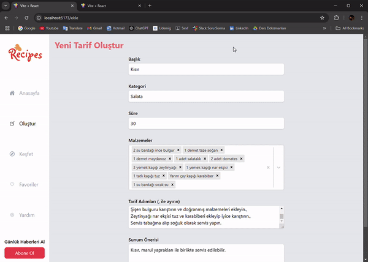

# DESCRIPTION

- This is a simple, pure full-stack recipes project. You can input the necessary information about recipes and save them to the system. Additionally, you can apply some filters, delete, create, and edit recipes as needed.

`To run the Server: 'nodemon server.js'`

`To run the Client: type 'npm run dev'`

# FRONTEND TECHNOLOGIES

- tailwind, axios, react-icons, react-router-dom, react-select, react-toastify

# BACKEND TECHNOLOGIES

- nodejs, nodemon, express, cors

# PROJECT GIF

